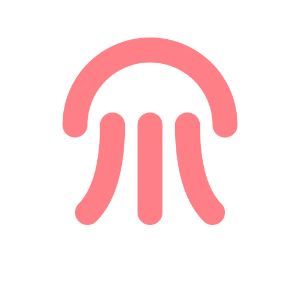

<p align="center">
  <!-- Replace this later with your final Jellyfish logo -->
  
</p>


# JellyFab
<p align="start">
  <a href="https://android.com">
    
  </a>
  <a href="https://kotlinlang.org">
    
  </a>
  <a href="https://developer.android.com/jetpack/compose">
    
  </a>
  <a href="https://jitpack.io/#iprashantpanwar/JellyFab">
    
  </a>
</p>

A modern, physics-driven floating action menu for **Jetpack Compose**. JellyFab provides a smooth, flexible, and delightful jelly-like expansion animation based on real spring dynamics — while remaining easy to integrate, fully customizable, and production-ready.

Designed for apps that value motion, playfulness, and polished interaction.

<p align="center">
  <video src="art/jellyfab.mp4" autoplay loop muted playsinline style="width: 300px; border-radius: 12px;"></video>
</p>

Inspiration: https://dribbble.com/shots/3908815-Floating-button

---

## ✨ Features

- **Jelly-like elastic expansion** using physics-based `Animatable` control
- **Primary mini-FAB orbit** arranged along a curved arc
- **Optional secondary expansion layer** that emerges from the first FAB
- **Scrim dimming layer** with tap-to-collapse support
- **Composable-first API** — works cleanly with state hoisting
- **Lightweight, dependency-free**, built entirely using Jetpack Compose

---

## 🚀 Installation (JitPack)

Add JitPack to your root `settings.gradle` / `settings.gradle.kts`:

```kotlin
dependencyResolutionManagement {
    repositories {
        mavenCentral()
        maven("https://jitpack.io")
    }
}
```

Add the dependency:

```kotlin
dependencies {
    implementation("com.github.iprashantpanwar:JellyFab:<latest-version>")
}
```

> Check the latest version here: https://jitpack.io/#iprashantpanwar/JellyFab

---

## 🧩 Usage

```kotlin
val jellyState = rememberJellyFabState()

JellyFab(
    state = jellyState,
    primaryItems = listOf(
        JellyFabItem(Icons.Default.Email) { /* action */ },
        JellyFabItem(Icons.Default.Notifications) { /* action */ },
        JellyFabItem(Icons.Default.Settings) { /* action */ }
    ),
    secondaryItems = listOf(
        JellyFabItem(Icons.Default.Edit) { /* action */ },
        JellyFabItem(Icons.Default.Share) { /* action */ }
    )
)
```

### State Hoisting

```kotlin
val state = rememberJellyFabState(initialExpanded = false)
state.expanded = true   // expand primary layer
state.secondaryExpanded = true // expand secondary layer
```

---

## 🎛 Configuration

`JellyFabConfig` allows tuning the animation feel:

```kotlin
JellyFab(
    config = JellyFabConfig(
        expandStagger = 0L,
        collapseStagger = 100L,
        bounceFactor = 0.18f,
        shadowOpacity = 0.55f
    )
)
```

---

## 🎨 Customizing Appearance

- Replace icons
- Change FAB sizes and colors
- Adjust arc layout spacing
- Control scrim visibility

Example:

```kotlin
JellyFab(
    fabColor = Color(0xFFFF6F91),
    secondLayerFabColor = Color(0xFF6BA5FF),
    showScrim = true
)
```

---

## 🧠 Architecture Overview

| Layer | Description |
|------|-------------|
| `JellyFabState` | Controls expanded/collapsed state for both layers |
| `JellyPhysics.kt` | Defines spring & bounce animation orchestration |
| `JellyBlob.kt` | Renders the main jelly shape & deformation path |
| `JellyFab.kt` | High-level composable coordinating visual layers |

---

## 🐞 Issues & Contributions

Contributions, suggestions, and improvements are welcome.

If you encounter an issue:
1. Search existing issues
2. If not found, open a new issue with reproduction details

---

Made with ❤️ and too many physics tweeks 🎛️

## 📜 License

```
Apache License 2.0
Copyright 2025 Prashant Panwar
```

This library is free to use and modify.

---

