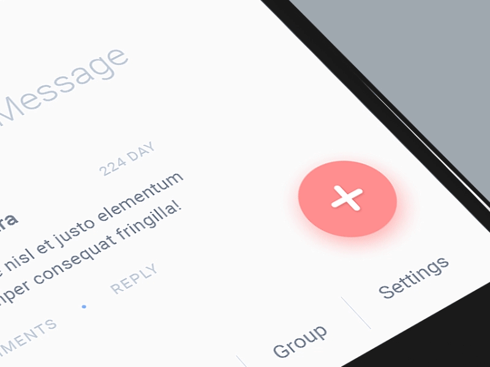
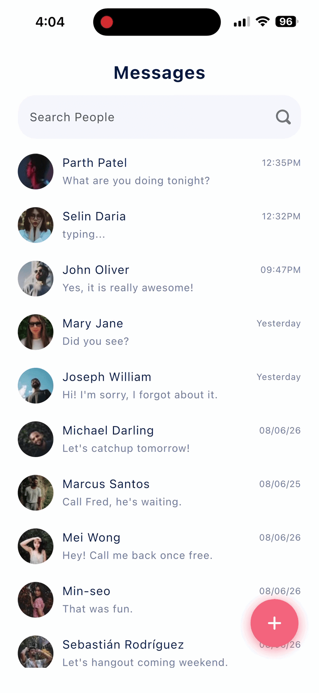
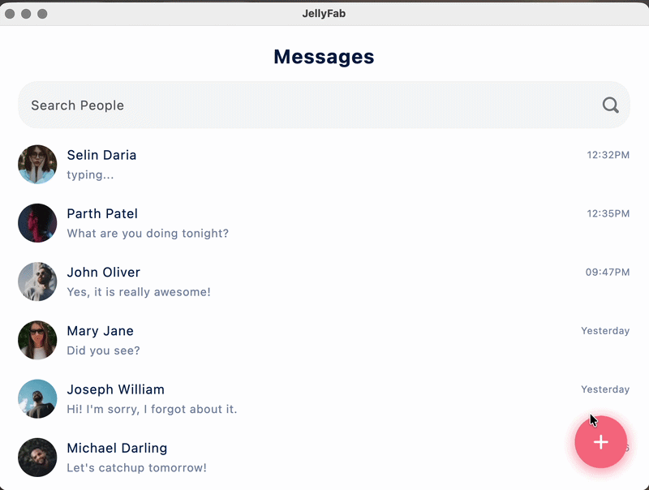
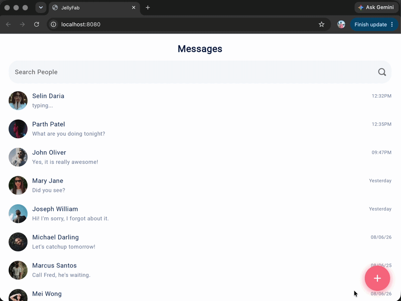

<p align="center">
  
</p>

<h1 align="center">JellyFab</h1>

<p align="center">
  <strong>A physics-driven Floating Action Button menu for Compose Multiplatform.</strong>
</p>

<p align="center">
Create beautiful, jelly-like floating action menus with natural spring animations using a single API across Android, iOS, Desktop, Web, and Wasm.
</p>

<p align="center">
Designed for apps that value motion, playfulness, and polished interaction.
</p>

<p align="center">
📖 Featured on <strong>ProAndroidDev</strong> · <a href="https://medium.com/proandroiddev/i-built-a-jelly-like-fab-menu-for-jetpack-compose-42e9f65f6576">Read the article</a>
</p>

<p align="center">

[](https://central.sonatype.com/artifact/io.github.iprashantpanwar/jellyfab)
[](https://github.com/iprashantpanwar/JellyFab/actions/workflows/ci.yml)
[](https://iprashantpanwar.github.io/JellyFab/)
[](https://kotlinlang.org)
[](https://www.jetbrains.com/compose-multiplatform/)
[](LICENSE)

</p>

---

<p align="center">
  
</p>

---

## 🎯 Inspiration

Inspired by this beautiful Dribbble concept:

https://dribbble.com/shots/3908815-Floating-button

<p align="center">
  
</p>

---

## 📸 Demo

JellyFab provides the same smooth, physics-driven floating action menu across every Compose Multiplatform target.

| Android                                                           | iOS                                                       |
|-------------------------------------------------------------------|-----------------------------------------------------------|
|  |  |

| Desktop                                                           | Web                                                       |
|-------------------------------------------------------------------|-----------------------------------------------------------|
|  |  |


---

# 🚀 Installation

JellyFab is available on **Maven Central**.

```kotlin
dependencies {
    implementation("io.github.iprashantpanwar:jellyfab:<latest-version>")
}
```

---

# 🧩 Quick Start

```kotlin
val state = rememberJellyFabState()

JellyFab(
    state = state,
    primaryItems = listOf(
        JellyFabItem(Icons.Default.Email) { },
        JellyFabItem(Icons.Default.Notifications) { },
        JellyFabItem(Icons.Default.Settings) { }
    ),
    secondaryItems = listOf(
        JellyFabItem(Icons.Default.Edit) { },
        JellyFabItem(Icons.Default.Share) { }
    )
)
```

---

# 🎛 State

```kotlin
val state = rememberJellyFabState()

state.expanded = true
state.secondaryExpanded = true
```

---

# ⚙️ Customization

JellyFab exposes a configurable API allowing you to customize animation timing, spacing, colors, shadows, and motion.

Example:

```kotlin
JellyFab(
    config = JellyFabConfig(
        expandStagger = 0L,
        collapseStagger = 100L,
        bounceFactor = 0.18f,
        shadowOpacity = 0.55f
    )
)
```

---

# 🎨 Appearance

Customize

- Colors
- Icons
- FAB sizes
- Arc spacing
- Shadow
- Scrim
- Motion

Example:

```kotlin
JellyFab(
    fabColor = Color(0xFFFF6F91),
    secondLayerFabColor = Color(0xFF6BA5FF),
    showScrim = true
)
```

---

# 🏗 Architecture

| Component | Responsibility |
|------------|----------------|
| JellyFab | Main composable |
| JellyFabState | Expansion state |
| JellyPhysics | Spring animation engine |
| JellyBlob | Jelly deformation renderer |
| JellyFabConfig | Animation configuration |

---

# 📚 API Documentation

Browse the latest API documentation:

**https://iprashantpanwar.github.io/JellyFab/**


---

# 🤝 Contributing

Contributions are always welcome.

If you'd like to improve JellyFab:

- Report bugs
- Suggest features
- Improve documentation
- Submit pull requests

Please use the provided Issue and Pull Request templates.

---

# 🛣 Roadmap

- ✅ Compose Multiplatform migration
- ✅ Android
- ✅ iOS
- ✅ Desktop
- ✅ JavaScript
- ✅ Wasm
- ⏳ More layout options

---

# ❤️ Acknowledgements

Thanks to the Compose Multiplatform and Kotlin communities for making modern cross-platform UI development possible.

---

# 📄 License

JellyFab is licensed under the Apache License 2.0.

See the [LICENSE](LICENSE) file for details.